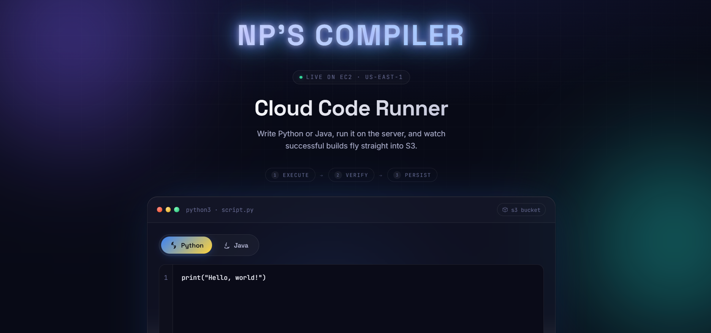
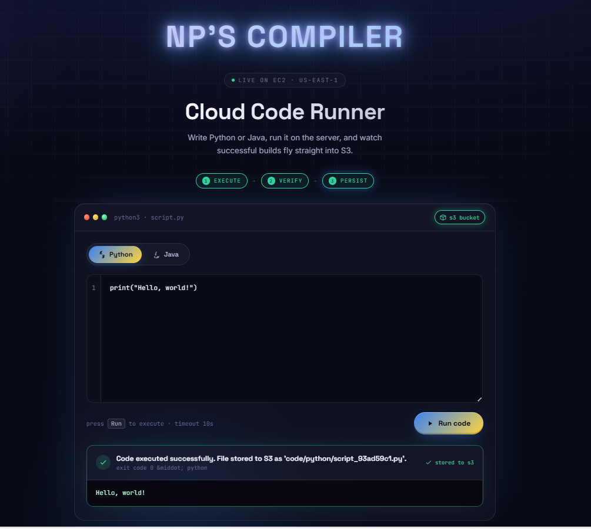
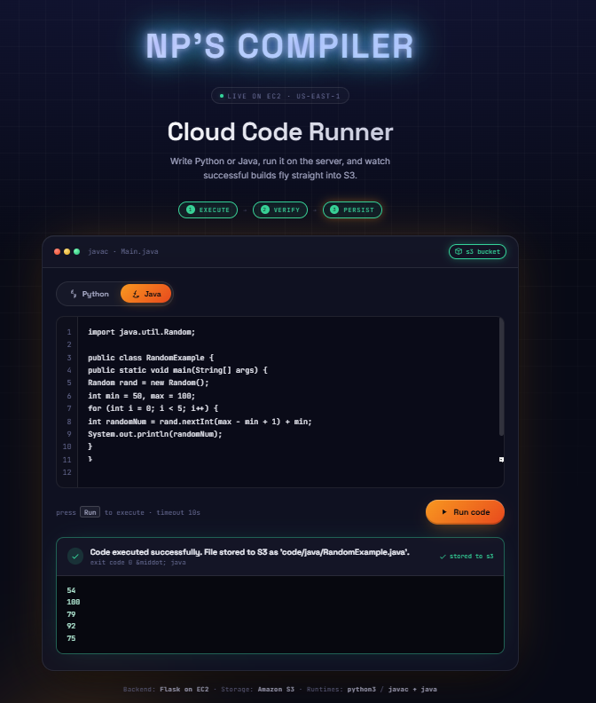
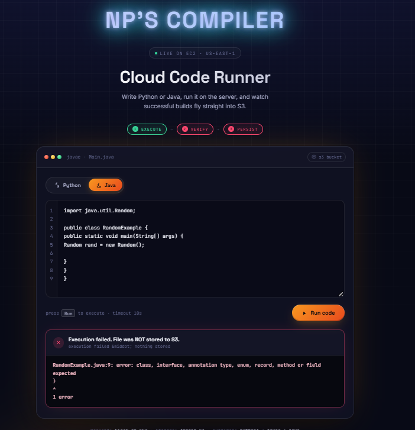
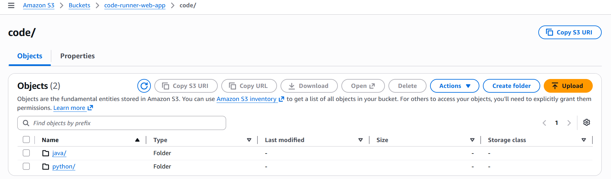
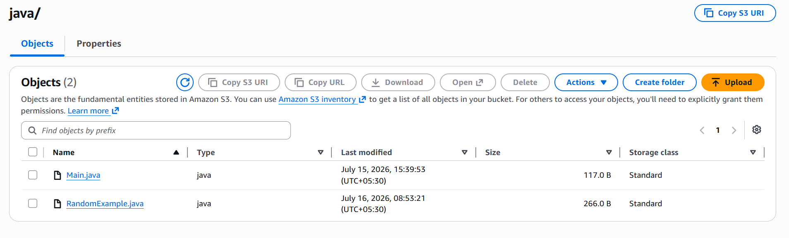

# ☁️ Cloud Code Runner (Python & Java on AWS)

Cloud Code Runner is a web-based application that allows users to write and execute **Python** and **Java** code directly from the browser. The application executes code on an **AWS EC2** instance and automatically uploads **only successfully executed source files** (`.py` and `.java`) to **Amazon S3**.

---

# 🚀 Features

- Execute Python and Java code online
- Real-time code execution using Flask
- Upload successful source files to Amazon S3
- Automatic Java class detection
- Modern responsive UI
- Temporary files cleaned after execution
- CI/CD using GitHub, AWS CodeBuild & CodePipeline

---

# ☁️ AWS Services Used

- Amazon EC2
- Amazon S3
- AWS IAM
- AWS CodeBuild
- AWS CodePipeline
- GitHub

---

# 💻 Technologies Used

- Python
- Flask
- HTML
- CSS
- JavaScript
- Java (JDK)
- Boto3
- Git & GitHub
- Ubuntu Linux

---

# 📂 Project Workflow

```text
                User
                  │
                  ▼
              Web UI
                  │
                  ▼
        Flask API (/run)
                  │
                  ▼
     Execute Python / Java
                  │
                  ▼
              Success?
          ┌──────────────┐
          │              │
         Yes            No
          │              │
          ▼              ▼
   Upload File to S3   Show Error
```

---

# 📁 Project Structure

```text
code-runner-app/
├── app.py
├── requirements.txt
├── buildspec.yml
├── templates/
│   └── index.html
└── static/
    └── style.css
```

---

# 🔐 Security

- IAM Role used for Amazon S3 access
- No AWS Access Keys stored on EC2
- Only successfully executed source files are uploaded
- Temporary execution files are deleted automatically
- Execution timeout enabled

---

# 🚀 CI/CD Pipeline

```text
GitHub Repository
        │
        ▼
AWS CodePipeline
        │
        ▼
AWS CodeBuild
        │
        ▼
Build Artifacts stored in Amazon S3
```

---

# 📈 Future Enhancements

- Docker sandbox execution
- User authentication
- Support for more programming languages
- DynamoDB execution history
- Auto Scaling & Load Balancer

---

# 👨‍💻 Author

**Nilesh Rajendra Pardeshi**

- B.Tech – Artificial Intelligence & Machine Learning
- R. C. Patel Institute of Technology, Shirpur
- AWS with Python Course Trainee (Symbiosis, Sponsored by Capgemini)

---

# ⭐ Project Summary

Cloud Code Runner is a cloud-based compiler that executes **Python** and **Java** programs on an **AWS EC2** instance. After successful execution, the application automatically uploads the source code to **Amazon S3** while displaying the program output in the browser. The project also integrates **GitHub**, **AWS CodeBuild**, and **AWS CodePipeline** to implement an automated CI/CD workflow.

---

# 📸 Project Screenshots

## 🟢 Successful Code Execution

### Home Page



---

### Successful Java/Python Execution



---

### Program Output



---

## 🔴 Failed Code Execution

### Error Message



---

## ☁️ Source Files Stored in Amazon S3

### Amazon S3 Bucket



---

### Python & Java Source Files



---

# ⭐ Highlights

- 🌐 Browser-based Cloud Compiler
- 🐍 Python & ☕ Java Support
- ☁️ Amazon EC2 Execution
- 📦 Automatic Amazon S3 Upload
- 🔒 Secure IAM Role Authentication
- 🚀 GitHub + CodeBuild + CodePipeline CI/CD
- 🧹 Automatic Temporary File Cleanup
- 💡 Modern Responsive User Interface